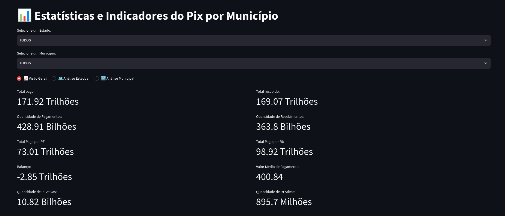
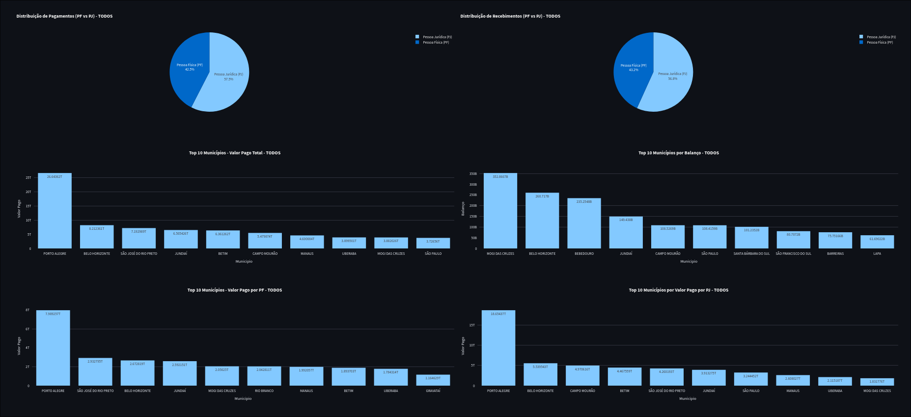
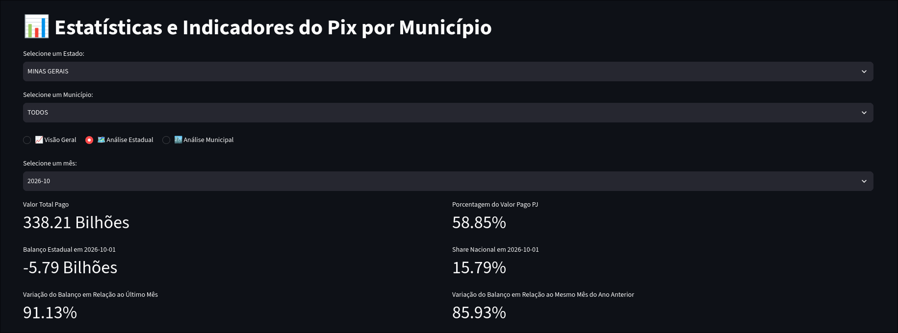
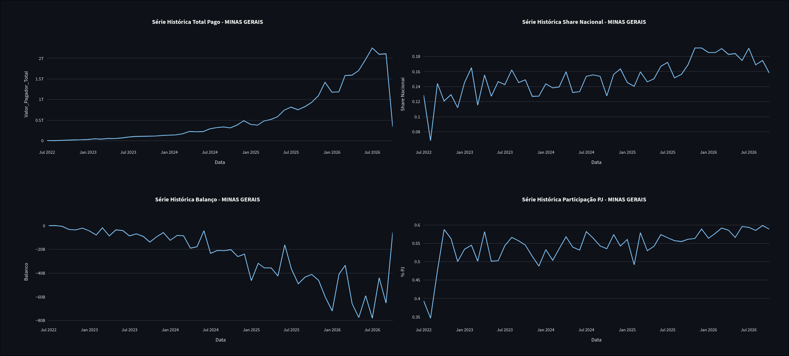
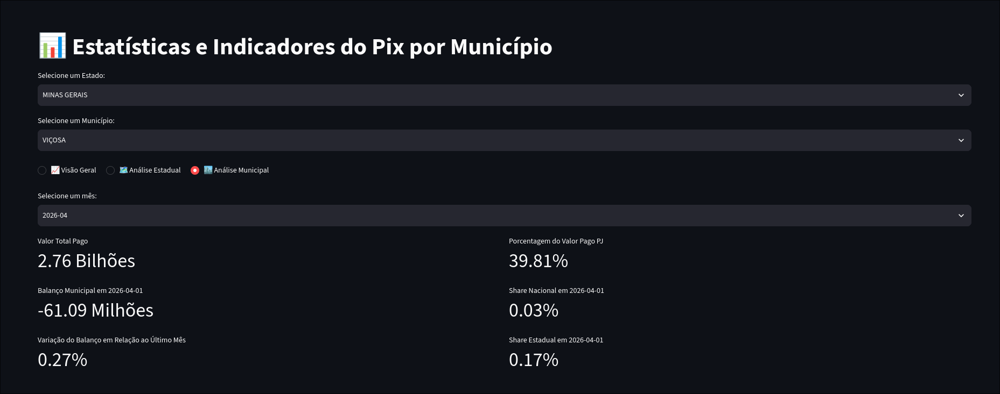
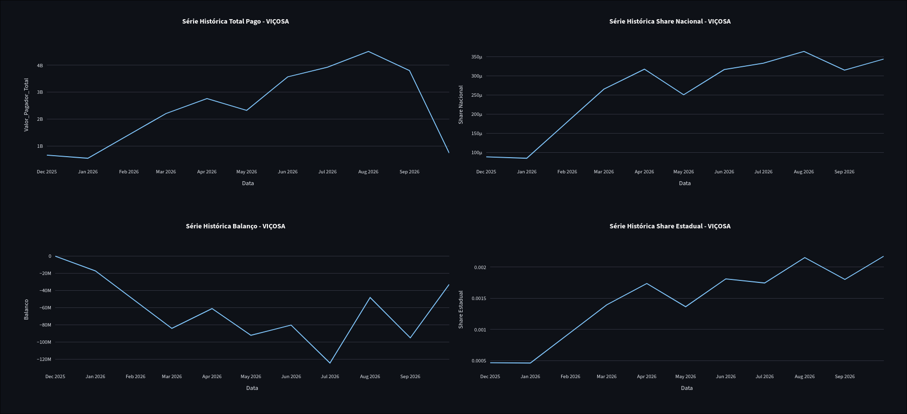

# Dados PIX

Dashboard em Streamlit com estatísticas do Pix por município, usando a API de dados abertos do Banco Central. Os dados foram armazenados em PostgreSQL e integrados com o dashboard.

## Dashboard

### 📈 Visão Geral

Indicadores gerais por estado. Exibe o total pago, total recebido, quantidade de PF e PJ ativas, entre outros. Também exibe gráficos comparativos de pagamento e recebimento PF vs PJ e ranking de municípios por total pago, balanço e total pago por PF e PJ.

<p align="center">
  
  
</p>

### 🗺️ Análise Estadual

Indicadores temporais por estado. Exibe, para um determinado mês, o total pago, participação de PJ, share nacional e variações de balanço. Os gráficos contemplam séries históricas para o total pago, share nacional, balanço e participação PJ.

<p align="center">
  
  
</p>

### 🏙️ Análise Municipal

Indicadores temporais por município. Exibe o total pago, participação PJ, variação mensal do balanço, share nacional e estadual. Os gráficos contemplam séries históricas para o total pago, share nacional e estadual e balanço.

<p align="center">
  
  
</p>


## Estrutura

```
src/
  app.py              # dashboard Streamlit
  config.py           # URL da API e conexão com o banco
  load_database.py    # pipeline: API -> bronze -> silver -> gold
  models/models.py    # modelos SQLAlchemy
  queries/queries.py  # consultas SQL usadas pelo dashboard
  utils/              # API, banco, pré-processamento, gráficos
docker-compose.yml
Dockerfile
```

O banco de dados segue a seguinte arquitetura:

| Camada | Tabelas                                 | Conteúdo                                                                  |
| --------| -----------------------------------------| ---------------------------------------------------------------------------|
| Bronze | `DadosAPI`                              | Dados brutos da API (um registro por município/mês)                       |
| Silver | `DadosSilver`                           | Indicadores calculados linha a linha (totais, tickets médios, proporções) |
| Gold   | `DadosEstadoGold`, `DadosMunicipioGold` | Dados agregados, shares e variações temporais para o dashboard            |

## Uso -> Banco no Docker, aplicação local

### 1. Subir o banco

```bash
docker compose up -d --build
```

O banco fica disponível em `localhost:3000` (porta 5432 do container). Por padrao:

- Usuário: `app`
- Senha: `app_pass`
- Banco: `appdb`

Por padrao, o banco eh carregado com dados dos ultimos 4 anos. Essa configuracao pode ser alterada em src/load_database.py mudando o valor de n_meses.

### 2. Criar o ambiente virtual e instalar dependências

```bash
python -m venv .venv
source .venv/bin/activate
pip install -r requirements.txt
```

### 3. Iniciar o dashboard

Espere o dowload dos dados terminar e rode:

```bash
python -m streamlit run src/app.py
```

Acesse: <http://localhost:8501>